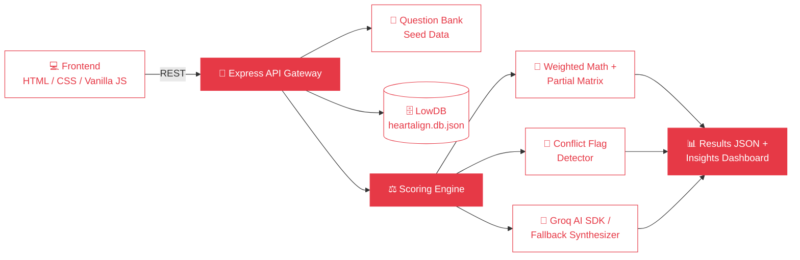
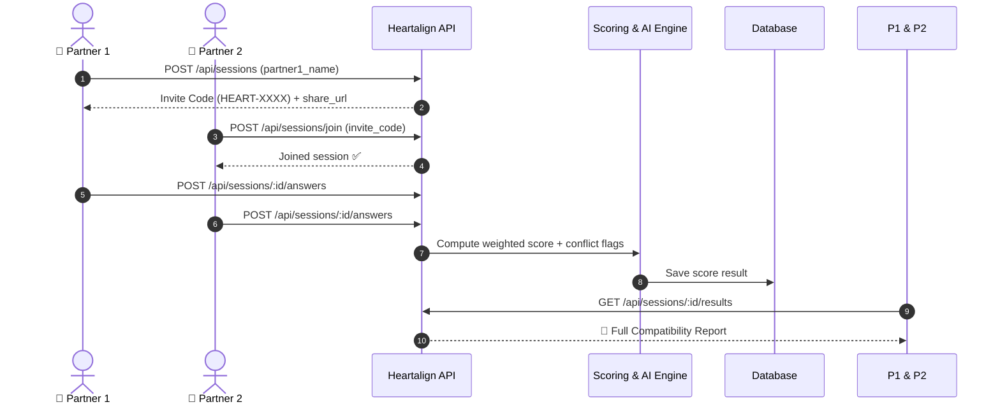

<div align="center">


<br/>

[](https://github.com/varunraj-2005/Heartalign)
[](https://github.com/varunraj-2005/Heartalign/stargazers)
[](https://github.com/varunraj-2005/Heartalign/network/members)
[](#-license)

<br/>


</div>


## 📖 Table of Contents

<div align="center">

| [💖 Overview](#-overview) | [✨ Features](#-features) | [🏗️ Architecture](#️-architecture) | [🔄 Workflow](#-session--quiz-workflow) |
|:---:|:---:|:---:|:---:|
| **[📊 Scoring Matrix](#-scoring-matrix--weights)** | **[📡 API Reference](#-api-endpoints-reference)** | **[🚀 Getting Started](#-getting-started)** | **[🔐 Env Variables](#-environment-variables)** |
| **[📁 Project Structure](#-project-structure)** | **[🧪 Testing](#-testing)** | **[❓ FAQ](#-faq)** | **[📬 Contact](#-contact)** |

</div>


## 💖 Overview

**Heartalign** is a full-stack, AI-assisted **compatibility engine** built for couples. Two partners take a synced, multi-category quiz — Heartalign runs the answers through a **weighted mathematical scoring model**, flags friction points, and (optionally) asks **Groq AI** to write a personalized relationship summary.

It's not a "count the matches" quiz. It's a real scoring pipeline:

> 🔍 Category weighting → 📐 partial-match matrices → 🚩 conflict-pair detection → 🤖 AI synthesis (with a rule-based fallback if no API key is set)

<div align="center">


</div>

<br/>

## ✨ Features

<table>
<tr>
<td width="50%" valign="top">

### 💑 For Couples
- 🔗 Instant invite-code session creation (`HEART-XXXX`)
- ⏱️ Real-time "has my partner finished?" polling
- 📝 Multi-category, mixed-format quiz (scale + multiple choice)
- 🗂️ Side-by-side reflection answers to spark conversation
- 📈 Historical compatibility tracking per couple

</td>
<td width="50%" valign="top">

### 🧠 Under the Hood
- ⚖️ 6-category **weighted scoring engine**
- 🧮 Partial-match matrices for nuanced answers
- 🚩 Complementary conflict-pair detection
- 🤖 Groq AI-generated relationship insights
- 🛟 Automatic rule-based fallback if no API key

</td>
</tr>
</table>

### 🎨 Interface
- Glassmorphism UI with a **liquid SVG heart loader**
- Animated progress bar + floating background particles
- Fully responsive across desktop and mobile

<br/>

## 🏗️ Architecture



<br/>

## 🔄 Session & Quiz Workflow



<br/>

## 📊 Scoring Matrix & Weights

| Category | Weight | Focus Area |
|---|:---:|---|
| 🏛 **Values & Life Goals** | `25%` | Marriage, kids, finances, career alignment |
| 🤝 **Trust & Communication** | `25%` | Transparency, privacy, check-in frequency |
| ⚡ **Conflict Style** | `15%` | Cooling periods, apology styles, confrontation |
| 💞 **Intimacy & Affection** | `15%` | Love languages, PDA comfort, affection frequency |
| 🏡 **Daily Life & Habits** | `10%` | Sleep schedules, chores, weekend routines |
| 🍕 **Fun & Trivia** | `10%` | Date nights, food, travel style |

**How the math works:**

- **Scale (1–5) questions:** `Score = max(0, 100 - |V1 - V2| × 25)` — a difference of 0 = 100% match, a difference of 4 = 0% match.
- **Multiple-choice questions:** exact match = 100%; partial matches use a predefined lookup matrix; certain answer pairs trigger a flagged **conflict pair**.
- **Open-ended reflections:** unscored, shown side-by-side to spark discussion.

<br/>

## 📡 API Endpoints Reference

<details>
<summary><b>🔍 Click to expand full endpoint list</b></summary>

<br/>

**Health Check**
```
GET /api/health
```

**Question Bank**
```
GET /api/questions
GET /api/questions?category=Conflict%20Style
```

**Sessions**
```
POST /api/sessions                      # Create session (Partner 1)
GET  /api/sessions/code/:code           # Look up by invite code
POST /api/sessions/join                 # Join session (Partner 2)
GET  /api/sessions/:id/status           # Real-time completion status
POST /api/sessions/:id/answers          # Submit quiz answers
GET  /api/sessions/:id/results          # Get full compatibility report
GET  /api/couples/:coupleId/history     # Get couple's quiz history
```

**Example — create a session:**
```json
{
  "partner1_name": "Alex"
}
```
```json
{
  "success": true,
  "session": {
    "session_id": "ses_9b1deb4d",
    "invite_code": "HEART-8K92",
    "status": "waiting_for_partner2",
    "share_url": "http://localhost:505/join/HEART-8K92"
  }
}
```

</details>

<br/>

## 🚀 Getting Started

New to Git? Just copy each command below into your terminal, one at a time.

### ✅ Prerequisites

| Requirement | Version |
|---|---|
| Node.js | `v18.0.0+` |
| npm | `v9.0.0+` |

### 1️⃣ Clone & install

```bash
git clone https://github.com/varunraj-2005/Heartalign.git
cd Heartalign/backend
npm install
```

### 2️⃣ Configure environment

Create a `.env` file inside `backend/` (see [Environment Variables](#-environment-variables)).

### 3️⃣ Run the dev server

```bash
npm run dev
```

You should see:

```
======================================================
💖 Heartalign Backend API is running on port 505
🌍 Interactive API Tester UI: http://localhost:505
======================================================
```

Open **http://localhost:505** to launch the app.

<br/>

## 🔐 Environment Variables

| Variable | Type | Default | Required? | Description |
|---|---|---|:---:|---|
| `PORT` | `number` | `505` | No | Port the Express server listens on |
| `GROQ_API_KEY` | `string` | `undefined` | Optional | Enables Groq AI relationship insights — falls back to rule-based insights if omitted |

<br/>

## 📁 Project Structure

```
Heartalign/
├── backend/
│   ├── src/
│   │   ├── data/questions.seed.ts       # Question bank across 6 pillars
│   │   ├── db/database.ts               # LowDB persistence layer
│   │   ├── routes/                      # question & session routes
│   │   ├── services/scoringEngine.ts    # Weighted math + AI synthesis
│   │   ├── types/index.ts               # TS interfaces & weight mapping
│   │   └── server.ts                    # Express entry point
│   ├── tests/scoring.test.ts
│   ├── heartalign.db.json
│   └── package.json
├── frontend/
│   ├── index.html                       # Glassmorphic UI + liquid heart loader
│   ├── style.css
│   └── app.js
├── assets/
│   └── heartbeat.svg                    # Animated heart used in this README
└── README.md
```

<br/>

## 🧪 Testing

```bash
cd backend
npm test
```

```
✔ Scale Scoring (0-diff=100, 4-diff=0)         → PASSED
✔ Multiple Choice Match & Partial Matrix        → PASSED
✔ Conflict Flag Pair Trigger                    → PASSED
✔ Full Compatibility Calculation & Weighting    → PASSED
```

<br/>

## ❓ FAQ

**How is privacy handled?**
Answers are matched server-side once both partners submit, then shown side-by-side to spark conversation.

**Can partners take the quiz at different times?**
Yes — session state persists. Partner 2 can join and finish whenever they're ready.

**What if I skip the Groq API key?**
No problem — Heartalign automatically switches to built-in rule-based insights.

<br/>

## 📜 License

Licensed under the **ISC License**.

<br/>

## 📬 Contact

<div align="center">

**Varun Raj**

[](https://github.com/varunraj-2005)

<br/>

### 💖 If Heartalign resonated with you, drop it a star!


</div>
