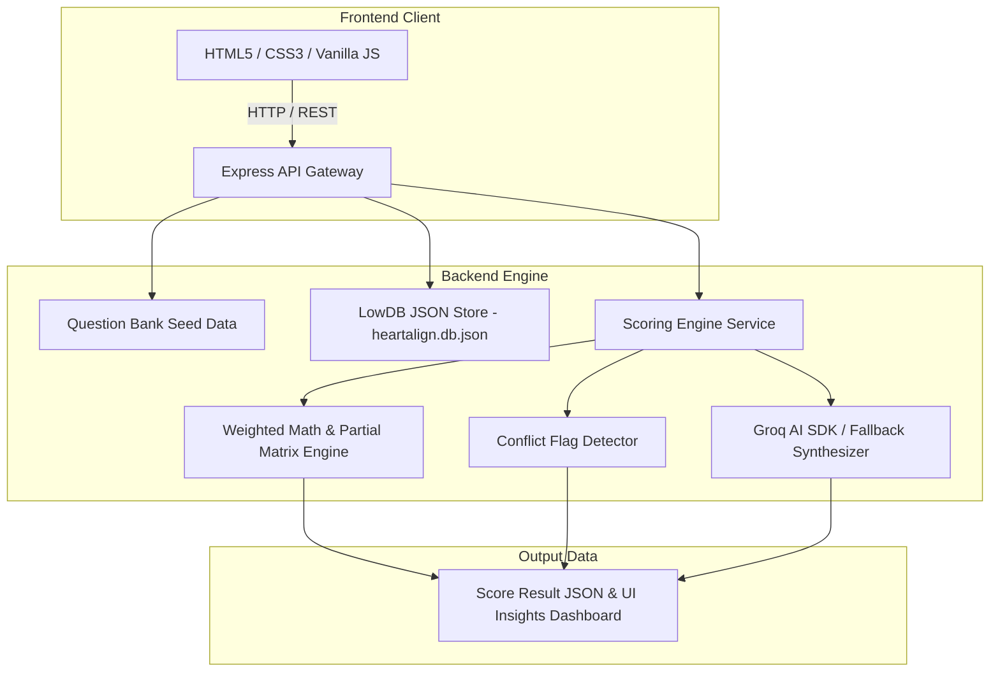
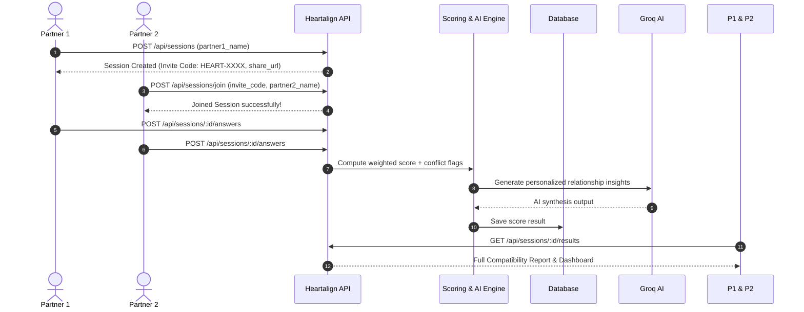

# 💖 Heartalign — Interactive Couples Compatibility Engine

<div align="center">


[](https://www.typescriptlang.org/)
[](https://nodejs.org/)
[](https://expressjs.com/)
[](https://groq.com/)
[](LICENSE)

*A full-stack, weighted compatibility scoring engine & AI-powered relationship insight platform designed for couples.*

[🚀 Quick Start](#-quick-start) • [✨ Key Features](#-key-features) • [📊 Scoring Matrix](#-scoring-matrix--weights) • [📡 API Reference](#-api-endpoints-reference) • [🏗 Architecture](#-system-architecture) • [🧪 Testing](#-testing)

</div>

---

## 📑 Table of Contents

- [💖 Project Overview](#-project-overview)
- [✨ Key Features](#-key-features)
- [🏗 System Architecture](#-system-architecture)
- [🔄 Session & Quiz Workflow](#-session--quiz-workflow)
- [📊 Scoring Matrix & Weights](#-scoring-matrix--weights)
- [📡 API Endpoints Reference](#-api-endpoints-reference)
- [🚀 Quick Start & Installation](#-quick-start)
- [🛠 Environment Variables](#-environment-variables)
- [🧪 Testing](#-testing)
- [📁 Directory Structure](#-directory-structure)
- [❓ Frequently Asked Questions](#-frequently-asked-questions)

---

## 💖 Project Overview

**Heartalign** is an interactive compatibility assessment app that allows couples to take synced, multi-category relationship quizzes and receive weighted alignment scores, conflict friction alerts, side-by-side reflections, and AI-synthesized coaching tips.

Unlike simple quizzes that just sum up matches, Heartalign employs a **sophisticated mathematical scoring engine** featuring:
- **Category-weighted evaluation** across 6 key pillars of relationship health.
- **Partial match matrices** for non-binary multiple-choice answers.
- **Complementary conflict pair detection** to identify opposing attachment or conflict resolution styles.
- **AI synthesis using Groq SDK** for personalized relationship summaries.
- **Historical score tracking** to track couple alignment over time.

---

## ✨ Key Features

<details open>
<summary><b>🔥 Core Application Highlights (Click to expand/collapse)</b></summary>

<br/>

### 1. ⚖️ Weighted 6-Category Compatibility Engine
Scores are computed dynamically using weighted contributions across:
- 🏛 **Values & Life Goals (25%)** — Kids, finances, career alignment, location preferences.
- 🤝 **Trust & Communication (25%)** — Emotional sharing, transparency, privacy expectations.
- ⚡ **Conflict Style (15%)** — Processing speed, de-escalation habits, discussion preferences.
- 💞 **Intimacy & Affection (15%)** — Love languages, physical affection frequency, vulnerability.
- 🏡 **Daily Life & Habits (10%)** — Daily rhythms, chore distribution, weekend preferences.
- 🍕 **Fun & Trivia (10%)** — Date night tastes, food cravings, travel styles.

### 2. ⚡ Live Partner Invite & Async Synchronization
- **Instant Invite Link Generation**: Partner 1 creates a session and gets a readable invite code (e.g. `HEART-7X92`).
- **Real-Time Poll Status**: Real-time polling via `/api/sessions/:id/status` lets each partner know when the other has completed the quiz.
- **Atomic Double-Completion Execution**: Compatibility calculations trigger automatically as soon as both partners submit.

### 3. 🤖 AI Relationship Insights (Groq Cloud SDK Integration)
- Powered by `groq-sdk` with LLM prompt engineering.
- Generates tailored relationship summaries highlighting key strengths, communication tips, and growth opportunities.
- **Built-in Fallback**: If an API key isn't provided, Heartalign falls back seamlessly to rule-based insight generation.

### 4. 🚩 Conflict Pair & Friction Detection
- Detects complementary conflict pairs (e.g., *Direct vs Avoidant* conflict approaches).
- Flags high-friction differences with constructive coaching notes.

### 5. 📈 Historical Couples Alignment Tracking
- Retains session history per `couple_id`.
- Track progress over time to see how relationship alignment evolves across multiple quiz sessions.

### 6. 🎨 Premium Glassmorphism UI
- Animated liquid SVG heart loader.
- Interactive category progress bar and option cards.
- Floating background particle animations and responsive desktop/mobile layouts.

</details>

---

## 🏗 System Architecture



---

## 🔄 Session & Quiz Workflow



---

## 📊 Scoring Matrix & Weights

| Category | Weight | Question Types Used | Key Focus Area |
| :--- | :---: | :--- | :--- |
| **Values & Life Goals** | `25%` | Multiple Choice Match | Marriage, children, financial philosophy, career balance |
| **Trust & Communication** | `25%` | Scale (1-5), Multiple Choice | Transparency, phone privacy, check-in frequency |
| **Conflict Style** | `15%` | Multiple Choice Match | Processing cooling period, apology styles, confrontation |
| **Intimacy & Affection** | `15%` | Scale (1-5), Multiple Choice | Primary love language, PDA comfort, affection frequency |
| **Daily Life & Habits** | `10%` | Scale (1-5), Multiple Choice | Sleep schedules, household chore splitting, weekend routines |
| **Fun & Trivia** | `10%` | Multiple Choice Match | Ideal date night, food preferences, vacation styles |

<details>
<summary><b>📐 How Question Scoring Algorithms Work</b></summary>

<br/>

1. **Scale 1-to-5 Questions**:
   $$\text{Score} = \max(0, 100 - |V_1 - V_2| \times 25)$$
   - Difference of `0` $\rightarrow$ `100%` match
   - Difference of `1` $\rightarrow$ `75%` match
   - Difference of `2` $\rightarrow$ `50%` match
   - Difference of `4` $\rightarrow$ `0%` match

2. **Multiple Choice Match Questions**:
   - **Exact Match**: `100%` (or customized `exact_match_score`).
   - **Partial Match**: Looks up exact pair score in the predefined `partial_matrix`.
   - **Complementary Conflict Rules**: Checks if pair triggers a flagged conflict pair (e.g. `direct_confrontation` vs `need_time`).

3. **Open-Ended Reflections**:
   - Qualitative non-scored questions displayed side-by-side on the results dashboard for deep conversation starters.

</details>

---

## 📡 API Endpoints Reference

<details open>
<summary><b>🔍 Expand Interactive API Reference Card</b></summary>

<br/>

### 1. Health Check
- **`GET /api/health`**
- **Description**: Returns server status, version, and server timestamp.
- **Sample Response**:
  ```json
  {
    "status": "ok",
    "app": "Heartalign Backend API & Scoring Engine",
    "version": "1.0.0",
    "timestamp": "2026-08-22T16:25:46.000Z"
  }
  ```

---

### 2. Fetch Question Bank
- **`GET /api/questions`**
- **Description**: Returns all seed questions grouped across categories.
- **Query Parameters**: Optional `?category=Conflict%20Style`

---

### 3. Session Operations

#### ➕ Create New Session (Partner 1)
- **`POST /api/sessions`**
- **Request Body**:
  ```json
  {
    "partner1_name": "Alex"
  }
  ```
- **Response**:
  ```json
  {
    "success": true,
    "session": {
      "session_id": "ses_9b1deb4d-3b7d-4bad-9bdd-2b0d7b3dcb6d",
      "invite_code": "HEART-8K92",
      "couple_id": "cpl_a1b2c3d4",
      "partner1_name": "Alex",
      "status": "waiting_for_partner2",
      "share_url": "http://localhost:505/join/HEART-8K92"
    }
  }
  ```

#### 🔍 Lookup Session by Invite Code
- **`GET /api/sessions/code/:code`**
- **Example**: `GET /api/sessions/code/HEART-8K92`

#### 🤝 Join Session (Partner 2)
- **`POST /api/sessions/join`**
- **Request Body**:
  ```json
  {
    "invite_code": "HEART-8K92",
    "partner2_name": "Taylor"
  }
  ```

#### ⏱ Check Real-Time Session Status
- **`GET /api/sessions/:id/status`**
- **Response**:
  ```json
  {
    "success": true,
    "session_id": "ses_9b1deb4d",
    "status": "in_progress",
    "partner1": { "id": "ptr_111", "name": "Alex", "has_submitted": true },
    "partner2": { "id": "ptr_222", "name": "Taylor", "has_submitted": false },
    "both_completed": false
  }
  ```

#### 📝 Submit Quiz Answers
- **`POST /api/sessions/:id/answers`**
- **Request Body**:
  ```json
  {
    "partner_id": "ptr_111",
    "answers": {
      "q_val_1": "both_work_shared",
      "q_val_2": 4,
      "q_trust_1": 5,
      "q_con_1": "cool_off_first"
    }
  }
  ```

#### 🏆 Get Compatibility Results
- **`GET /api/sessions/:id/results`**
- **Response Highlights**: Overall weighted score, category breakdowns, conflict flags, side-by-side reflections, and AI relationship analysis.

#### 📈 Get Couple Quiz History
- **`GET /api/couples/:coupleId/history`**

</details>

---

## 🚀 Quick Start

### Prerequisites
- [Node.js](https://nodejs.org/) (`v18.0.0` or higher)
- `npm` (`v9.0.0` or higher)

### 1. Clone Repository & Install Dependencies

```bash
# Clone repository
git clone https://github.com/varunraj-2005/Heartalign.git
cd Heartalign

# Install backend dependencies
cd backend
npm install
```

### 2. Configure Environment

Create `.env` file inside `backend/`:

```env
PORT=505
GROQ_API_KEY=your_groq_api_key_here
```
> *Note: If `GROQ_API_KEY` is omitted, Heartalign automatically uses built-in smart fallback insights.*

### 3. Run Development Server

```bash
# Start backend server with auto-reload (ts-node-dev)
npm run dev
```

Server will output:
```text
======================================================
💖 Heartalign Backend API is running on port 505
🌍 Interactive API Tester UI: http://localhost:505
======================================================
```

Open `http://localhost:505` in your browser to launch the web client!

---

## 🛠 Environment Variables

| Variable | Type | Default | Required? | Description |
| :--- | :--- | :--- | :---: | :--- |
| `PORT` | `number` | `505` | No | Port on which Express server listens |
| `GROQ_API_KEY` | `string` | `undefined` | Optional | API Key for Groq Cloud LLM relationship analysis |

---

## 🧪 Testing

Heartalign features automated unit & integration test suites for the weighted scoring math, partial match matrices, and conflict detection logic.

Run tests via:

```bash
cd backend
npm test
```

Sample Output:
```text
=========================================================
🧪 Running Heartalign Scoring Engine Test Suite
=========================================================

✔ Test 1: Scale Scoring (0-diff=100, 1-diff=75, 4-diff=0) -> PASSED
✔ Test 2: Multiple Choice Match & Partial Matrix -> PASSED
✔ Test 3: Conflict Flag Pair Trigger -> PASSED
✔ Test 4: Full Compatibility Calculation & Category Weighting -> PASSED

=========================================================
🎉 All 4 Test Suites Passed Successfully!
=========================================================
```

---

## 📁 Directory Structure

```files
Heartalign/
├── backend/
│   ├── src/
│   │   ├── data/
│   │   │   └── questions.seed.ts      # Seed question bank across 6 pillars
│   │   ├── db/
│   │   │   └── database.ts            # LowDB JSON persistence layer
│   │   ├── routes/
│   │   │   ├── questionRoutes.ts      # Question fetching API
│   │   │   └── sessionRoutes.ts       # Session lifecycle & results API
│   │   ├── services/
│   │   │   └── scoringEngine.ts       # Weighted math, conflict detection & Groq AI
│   │   ├── types/
│   │   │   └── index.ts               # TypeScript interfaces & weights mapping
│   │   └── server.ts                  # Express application entry point
│   ├── tests/
│   │   └── scoring.test.ts            # Automated unit testing suite
│   ├── heartalign.db.json             # Local JSON DB storage
│   ├── package.json
│   └── tsconfig.json
├── frontend/
│   ├── index.html                     # Glassmorphic UI markup & SVG liquid loader
│   ├── style.css                      # Modern CSS variables, grid, animations
│   └── app.js                         # Dynamic state management & API interaction
├── .gitignore
└── README.md
```

---

## ❓ Frequently Asked Questions

<details>
<summary><b>💬 How does Heartalign handle privacy & answers visibility?</b></summary>
Answers are securely matched on the server when both partners submit. Individual responses are presented side-by-side in the results view to spark healthy discussion.
</details>

<details>
<summary><b>💬 Can Partner 1 and Partner 2 take the quiz at different times?</b></summary>
Yes! Sessions persist state in the backend database. Partner 1 can complete their answers, send the invite code `HEART-XXXX` to Partner 2, and Partner 2 can finish whenever they are free. Results unlock automatically when both complete.
</details>

<details>
<summary><b>💬 What happens if I don't set up a Groq API Key?</b></summary>
No problem! The backend automatically detects the missing key and switches to rule-based insights generation.
</details>

---

<div align="center">

Made with 💖 for couples everywhere. Built with TypeScript, Express & Groq AI.

</div>
